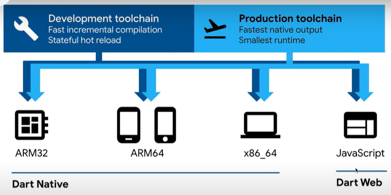

# week01

## Start

- dart는 2개의 컴파일러 소유
    
    
    
    - dart web : 내가 작성한 dart 코드를 javascript로 변환해주는 컴파일러
    - dart native : 내가 작성한 dart 코드를 여러 CPU의 아키텍쳐에 맞게 변환

- dart의 컴파일 되는 방법
    1. JIT : just-in-time → dart VM 사용해 코드의 결과를 바로 화면에 표시 (개발 중)
    2. AOT : ahead-of-time → 컴파일 먼저 진행하고, 그 결과인 바이너리를 배포

- dart 추가 정보
    - null safety 도입
    - https://dartpad.dev/ → 코드 작성 에디터

## Hello World

- main 함수가 없으면 오류 발생
    - main method 필수
- 세미콜론 까먹지 않도록 주의

```dart
void main() {
	print('hello world');
}
```

## The Var Keyword

- 변수 만드는 방법 2가지
    
    ```dart
    void main() {
    	var name = '소영';
    	name = 'soyoung';
    }
    ```
    
    ```dart
    void main() {
    	String name = '소영';
    	name = 'soyoung';
    }
    ```
    

## Dynamic Type

- dynamic : 여러가지 타입을 가질 수 있는 변수에 사용하는 키워드

```dart
void main() {
	var name;
	name = 'soyoung';
	name = 22;
	name = true;
}
```

```dart
void main() {
	dynamic name;
	if (name is Stirng) {
		name.length
	}
	if (name is int) {
		name.isOdd
	}
}
```

## Nullable Variables

- dart의 null safety
    - 개발자가 null 값을 참조할 수 없도록 하는 것
- 코드에서 null 값을 참조하면 런타임 에러 등장
    - 런타임 에러 : 사용자가 내가 만든 앱을 사용하던 중에 뜨는 에러
    - 컴파일 전에 null safety가 런타임 에러를 잡아줌

```dart
// Without null safety
bool isEmpty(String string) => string.length == 0;

main() {
	inEmpty(null);
}
```

- null : 부재, 아무것도 있지 않음

```dart
void main() {
	String? soso = 'soso';
	soso = null;
	
	if (soso != null) {
		soso.isNotEmpty;
	}
}
```

```dart
void main() {
	String? soso = 'soso';
	soso = null;
	soso?.isNotEmpty;
}
```

- dart의 null safety
    - 어떤 변수, 혹은 데이터가 null이 될 수 있음을 명시하는 것
    - 어떤 데이터가 null일 때 참조하지 않도록 도와줌

## Final Variables

- 1번 정의된 변수를 수정할 수 없게 만들기
    
    ```dart
    void main() {
    	final name = 'soso';
    }
    ```
    

## Late Variables

- late : 초기 데이터 없이 변수를 선언할 수 있도록 도와줌
    
    ```dart
    void main() {
    	late final String name;
    	// do something, go to api
    	name = 'soso'; // 나중에 데이터 넣기
    	print(name);
    }
    ```
    

## Constant Variables

- const는 compile-time constant 만들어줌
- const는 컴파일할 때 알고 있는 값에 사용

```dart
void main() {
	const API = '121212';
}
```

## Basic Data Types

```dart
void main() {
	String name = "soso"; // 또는 작음 따옴표
	bool alive = true;
	int age = 12;
	double money = 48.35;
	
	// num 자료형을 사용하면 그 숫자는 integer 또는 double
	num x = 12;
	x = 1.1;
}
```

## Lists

```dart
void main() {
	var numbers = [1, 2, 3, 4];
	List<int> numbers2 = [5, 6, 7, 8]; // 이때는 string 추가 불가
	
	// 메소드 종류
	numbers.add(6);
	numbers.first; // List의 1번째 요소
	numbers.last; // 마지막 요소
}
```

```dart
// collection if와 collection for 지원
void main() {
	var giveMeFive = true;
	var numbers = [
		1,
		2,
		3,
		4,
		if (giveMeFive) 5,
		// 또는
		if (giveMeFive) {
			numbers.add(5);
		}
	];
	print(numbers);
}

```

## String Interpolation

```dart
void main() {
	var name = 'soso'; // 큰 따옴표도 사용 가능
	var age = 20;
	// 변수와 계산 결과 넣기
	var greeting = 'Hello everyone, my name is $name and I\'m ${age + 2}';
	print(greeting);
}
```

## Collection For

```dart
void main() {
	var oldFriends = ['nico', 'lynn'];
	var newFriends = [
		'lewis',
		'ralph',
		'darren',
		for (var friend in oldFriends) "💕 $friend",
	];
	print(newFriends);
}
```

## Maps

```dart
void main() {
	var player = {
		'name': 'soso',
		'xp': 19.99,
		'superpower': false,
	};
	
	Map<int, bool> player2 = { // Map 대신 var 사용 가능
		1: true,
		2: false,
		3: true
	};
	
	Map<List<int>, bool> player3 = {
		[1, 2, 3, 4]: true,
	};
	
	List<Map<String, Object>> players4 = [
		{'name': 'nico', 'xp': 1342.467},
		{'name': 'nico', 'xp': 1342.467},
	];
}
```

## Sets

```dart
void main() {
	var numbers = {1, 2, 3, 4};
	Set<int> numbers2 = {5, 6, 7};
	
	numbers.add(1);
	print(numbers); 
	// 1 추가해도 출력은 1이 1번만
	// 리스트는 추가한 수만큼
}
```