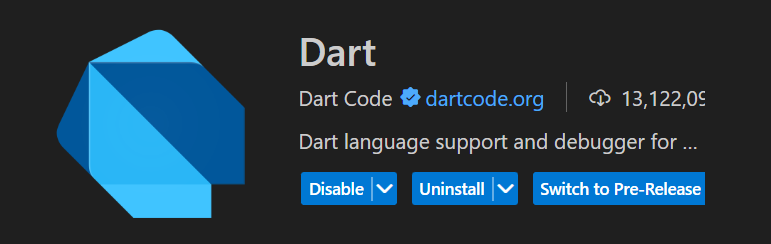

# week04

> [노마드 코더 - Flutter로 웹툰 앱 만들기](https://nomadcoders.co/flutter-for-beginners/lobby) → 이번주 진도 : #0.0 ~ #2.5
> 

## 1-0. Introduction

- 과거와 달리 현재 Flutter는 멀티 플랫폼을 지원한다.
    - iOS나 안드로이드, 웹/맥OS/윈도우/리눅스 상에서 동작하는 웹 어플리케이션, 임베디드

## 1-1. Requirements

- Dart는 Flutter 어플리케이션을 만들 때 사용되는 프로그래밍 언어이다.

## 1-2. Why Flutter

- Flutter를 사용하려면 Dart 언어와 Flutter 프레임워크만 알면 된다.
- 구글에서는 Flutter를 이용해서 기존 170만 줄의 코드를 110만 줄의 코드로 줄였다.
    - 개발자들의 시간 70%를 절약했다.
- Flutter를 이용해 만든 대표적인 앱 : Wonderous
- Flutter를 이용해 만든 대표적인 웹 : I/O Photo Booth, Flokk
    - 역동적이고, 다양한 애니메이션 표현 가능

## 1-3. How Flutter Works

- Swift로 iOS를, Java로 안드로이드를 만드는 네이티브 앱 개발을 할 때
    
    우리는 운영체제와 직접적인 대화를 한다.
    
    - 버튼이나 text input 등의 요소를 제작하라고 운영체제에게 전달하면
        
        운영체제가 안드로이드 또는 iOS 상의 버튼을 만들어준다.
        



- Flutter 또는 Dart 코드는 운영체제와 직접적으로 소통하지 않는다.
    - Flutter에서는 실제 iOS나 안드로이드 버튼을 만들어내는 기능이 존재하지 않는다.
    - Dart로 짜여진 코드는 Flutter 프레임워크 상에서 이용되며,
        
        어플리케이션의 실제 UI를 렌더링하는 “엔진”을 사용한다. (엔진: C언어나 C++언어 구성)
        
    - 즉, Flutter는 운영체제에 내장된 플랫폼 widget을 사용하지 않는다.
- 유저가 앱을 실행시키면 앱은 Flutter 라이브러리를 불러오고 우리가 만든 UI를 랜더링 해준다.
- 플랫폼이 엔진을 동작시키고, 엔진은 Dart Flutter 코드를 동작시키면 화면에 UI가 그려진다.

- Embedder는 엔진을 가동시키는 “runner” 프로젝트를 가리킨다.
- Embedder는 호스트 플랫폼 상에서 엔진을 가동시키는 역할을 한다.

## 1-4. Flutter vs React Native

- 네이티드 앱 운영체제 상에서 가능한 위젯을 사용하고 싶을 때는 React Native를 사용
    - 버튼 하나를 만들면 iOS와 안드로이드에서 서로 다르게 보인다.
    - 자바스크립트를 통해서 운영체제와 대화를 하고,
        
        운영체제는 네이티브 앱처럼 보이는 컴포넌트와 위젯을 만들어내기 때문이다.
        
- Flutter는 엔진을 통해서 모든 컴포넌트를 랜더링한다.
    - iOS 운영체제가 만들어 준 것처럼 보이는 컴포넌트를 사용해야 한다.
- 크로스플랫폼 어플리케이션을 만들고자 한다면 React Native를 /
    
    세밀한 디자인 요구사항이 있거나 요소 또는 애니메이션 전부를 
    
    커스터마이징해야 한다면 Flutter를 사용한다.
    

## 2-1. Installation

1. Flutter 다운받기 → 선택!
    
    [설치 안내 사이트](https://docs.flutter.dev/get-started/quick)
    
2. Flutter 온라인 에디터 사용하기

- Flutter 다운 방법
    1. Chocolatey 이용해서 SDK 설치 → [Chocolatey 설치 안내 사이트](https://chocolatey.org//install#individual)
    2. 시뮬레이터 설치 → 웹은 따로 설치하지 않아도 되서 웹으로 개발하기로 결정!

## 2-2. Dart Pad

- Flutter를 컴퓨터에 설치하지 않고 사용할 수 있는 방법 : https://dartpad.dev/
- 온라인에서 Dart 코드 실행 가능
- 자바스크립트로 컴파일 되기 때문에 DartPad에서 Flutter 앱을 실행할 수 있다.
- 다만, 새 파일을 만들지 못해 class를 활용해야 한다.

## 2-3. Running Flutter

1. 프로젝트 생성 : `flutter create toonflix`
2. Extension 설치
    
    
    
    
    
3. web으로 설정
    
    
    
4. toonflix > lib > main.dart
    
    이동 후 Start Debugging 누르기
    
    
    

## 2-4. Hello World

- 여러 Widget을 합쳐서 UI를 만든다.
- 위젯으로 만들기 위해선 flutter SDK에 있는 3개의 core Widget 중 하나를 상속받아야 한다.
    - StatelessWidget 사용
- 모든 위젯은 build 메소드를 구현해야 한다.
    - build 메소드 : 위젯의 UI 만든다.
    - build 메소드는 BuildContext 타입의 context라는 parameter를 받아온다.
- 앱의 root Widget은 두 개의 옵션 중 하나를 return 해야 한다.
    1. material 앱을 return : 구글 디자인 시스템
    2. cupertino 앱을 return : 애플 디자인 시스템
- scaffold는 화면의 구조를 제공해준다.
    - scaffold는 navigation bar를 구현할 수 있게 해준다.

```dart
import 'package:flutter/material.dart';

void main() {
  runApp(App());
}

class App extends StatelessWidget {
  @override
  Widget build(BuildContext context) {
    return MaterialApp(
      home: Scaffold(
        appBar: AppBar(
          title: Text('Hello flutter!'),
        ),
        body: Center(
          child: Text('Hello world!'),
        ),
      ),
    );
  }
}
```