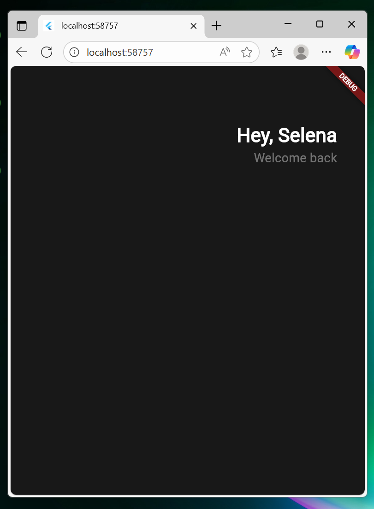

# week05

> [노마드 코더 - Flutter로 웹툰 앱 만들기](https://nomadcoders.co/flutter-for-beginners/lobby) → 이번주 진도 : #3.0 ~ #3.9
> 

(실습 코드는 따로 첨부 / 정리는 실행 화면 위주로)

### 0. Header

- appBar 없애기
    
    `appBar: AppBar(title: Text('Hello flutter!')),` 지우기
    
- 배경에 색 넣기
    
    `backgroundColor: Colors.black,` 작성하기
    
- Column이라는 Widget 사용
    - Row는 수평, Column은 수직 배열을 위한 것
- 강의에서 언급된 withOpacity 대신 withAlpha 사용
    - 0 ~ 255 사이의 숫자를 넣으면 투명도 조절 가능
- Row의 MainAxis는 수평 방향 / CrossAxis는 세로 방향
    - Column의 MainAxis는 수직 방향 / CrossAxis는 가로 방향

실행 화면

### 1. Developer Tools

오른쪽 상단의 돋보기 버튼 누르기

내가 가진 위젯 보여줌 → Layout Explorer 보기 가능 (미리보기도 보여줌)

2번째 버튼 누르면 가이드 라인 보여줌

### 2. Buttons Section

실행 화면

### 3. VScode Settings

- constant : 절대 바뀌지 않는 상수
- value : 사전에 알 수 있는 변수

Command Palette 열기

open user settings 작성 → JSON 파일 열기

- `‘’source.fixAll”: true` 코드 작성하면 파란줄 사라짐
    
    (본인은 따로 파란줄이 생기지 않아서 작성하지 않았음)
    
- `“dart.previewFlutterUiGuides”: true,` 코드 작성하면 부모가 무엇인지 알려주는 줄 생김
- `"editor.formatOnSave": true,` 코드 작성하면 저장할 때마다 코드를 포맷하고 정렬해줌

### 4. Code Actions

- 코드를 매우 간단한 방법으로 리팩토링 가능하도록 → Code Actions

전구 누르기

다양한 옵션 존재

### 5. Reusable Widgets

‘Error Lens’ extension 설치 → 에러 표시 가능

- Code Actions 사용해서 Extract Widget 실행 → 이름은 MyButton

자동으로 만들어진 모습

새로운 파일 생성

3번째 선택

‘생성자 함수 만들기’ 누르기

실행 화면

### 6. Cards

실행 화면

### 7. Icons and Transforms

실행 화면

### 8. Reusable Cards

새로운 파일 생성

실행 화면 → 스크롤도 가능

### 9. Code Challenge

(복습이므로 정리는 생략)