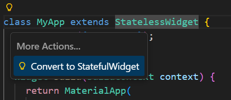

# week06

> [노마드 코더 - Flutter로 웹툰 앱 만들기](https://nomadcoders.co/flutter-for-beginners/lobby) → 이번주 진도 : #4.0 ~ #5.4
> 

## Stateful Widgets

### 0. State

- Stateless Widget : build 메서드를 통해서 변경되지 않을 데이터가 있는 UI 출력
- Stateful Widget : 위젯에 데이터를 저장하고, 실시간으로 데이터의 변화를 보고 싶을 때 사용
    1. 상태가 없는 위젯
    2. 위젯의 state = 위젯에 들어갈 데이터와 UI를 넣는 장소
    - 데이터가 변경되면 해당 위젯의 UI도 변경됨
    - `Convert to StatefulWidget` 누르면 변경 가능
    
    
    
    
    
    - Stateful Widget의 데이터는 단순한 dart 클래스 프로퍼티
    - 버튼이 누릴 때 클래스 안의 counter 값 증가시키기
    
    
    
    
    
    
    
    - 버튼이 눌리긴 하지만 숫자가 증가하지 않는 상태

### 1. setState

- 데이터가 변경될 때 위젯도 같이 업데이트됨
- setState 호출 필요 (2가지 경우) → 숫자 증가
    
    
    
    
    
    
    

### 2. Recap

- 이제 state에 다른 것을 저장할 것
    
    
    
    
    
- numbers 배열이 커질수록 화면에 표시되는 숫자도 증가
    - 배열에 아이템을 추가할 뿐만 아니라 setState 함수도 호출하기 때문
    
    
    

### 3. BuildContext

- code action 사용해서 MyLargeTitle 위젯 생성 → 별도의 위젯으로 분리함
    
    
    
    
    
    
    
- 앱의 모든 스타일을 한 곳에서 지정할 수 있는 기능 제공
    - 예시 : 한 곳에 복사하고, 해당 색상 변수 사용
    - MaterialApp에서 theme 사용
    
    
    
- StatelessWidget인 MyLargeTitle에서 theme의 값에 접근하는 것을 원함
    - 부모인 MyAppState에 접근하길 원함 → BuildContext 이용
    - 위젯 트리 → Flutter가 애플리케이션을 랜더링하는 방식을 보여줌
    
    
    
    - context는 Text 이전에 있는 모든 상위 요소들에 대한 정보 (= 위젯 트리에 대한 정보)
        
        context는 MyLargeTitle Text의 부모 요소들의 모든 정보를 담고 있음
        
    - 텍스트 색깔 바꾸기 (2가지 경우)
    
    
    
    
    
    
    

### 4. Widget Lifecycle

- Stateful Widget은 생명 주기를 가지고 있음
- MyLargeTitle 위젯을 Stateful Widget으로 변경
    
    
    
- 상태를 초기화하기 위한 메서드, InitState
    - 부모 요소에 의존하는 데이터를 초기화할 때 사용
    - ⭐ initState 메서드는 항상 build 메서드보다 먼저 호출되어야 하고, 단 한 번만 호출됨
    - `super.initState()` 호출해야 함
    - API에서 업데이트를 구독하고 싶을 때 사용
    
    
    
    (초기화 다른 방법 : 상태 변수 초기화 → 대부분 이렇게 사용)
    
    
    
- dispose : 위젯이 스크린에서 제거될 때 호출되는 메서드
    - API 업데이트, 이벤트 리스너로부터 구독 취소 또는 form의 리스너로부터 벗어날 때 사용
    - 무언가 취소하는 공간
    
    
    
    - 위젯이 위젯 트리에서 제거되기 전에 무언가 취소하고 싶을 때
    
    
    
    
    
    
    
    
    
    
    
    
    
    
    

## Pomodoro App

### 0. User Interface

- Pomodoro라는 애플리케이션 제작하는 것이 목표!
- Pomodoro는 생산성 기술로, 25분 동안 일한 뒤 5분 쉬는 것을 의미함
- Omar Sharif의 디자인 사용

- color 준비 후 StatelessWidget으로 변경
    
    
    
- screens 폴더 > home_screen.dart 파일 제작
    
    
    
    
    
    
    
- HomeScreen은 Scaffold 그려줘야 함
    - Column 안에 box 3개 존재 → 다른 하나가 나머지보다 큰 것 확인 가능
    - Flexible은 하나의 박스가 얼마나 공간을 차지할 지 비율을 정할 수 있음
    
    
    
    
    
    - 첫번째 Flexible
    
    
    
    - 두번째 Flexible
    
    
    
    - 세번째 Flexible
    
    
    
    
    

### 1. Timer

- 거꾸로 카툰트 세기
    - State를 카운트 할 시간으로 초기화해야 함
    - `borderRadius: BorderRadius.circular(50)` → 모서리 둥글게
    - Timer 라이브러리 : 정해진 간격에 한 번씩 함수 실행 가능
    - `import 'dart:async';` 선언 필요
    - late modifer는 property를 당장 초기화 하지 않아도 된다는 걸 의미 (= 나중에 초기화)
    
    ```dart
    int totalSeconds = 1500;
      late Timer timer;
    
      void onTick(Timer timer) {
        setState(() {
          totalSeconds = totalSeconds - 1;
        });
      }
    
      void onStartPressed() {
        timer = Timer.periodic(Duration(seconds: 1), onTick);
      }
    ```
    
    - `25:00` → `$totalSeconds`
    - `onPressed: () {}` → `onPressed: onStartPressed`
    
    
    

### 2. Pause Play

- 일시 정지 버튼 만들기
    - `bool isRunning = false;` 작성
    
    
    
    
    
    
    
    - `onPressed: isRunning ? onPausePressed : onStartPressed,` 작성
    
    
    

### 3. Date Format

- Pomodoros를 몇 번 완료했는지 세어줄 것
    - `int totalPomodoros = 0;` 작성
    - `0` → `$totalPomodoros`
    - `int totalSeconds = 10;` 으로 변경
    
    
    
    
    
    
    
    - `static const twentyFiveMinutes = 1500;` 작성
    - `int totalSeconds = twentyFiveMinutes;` 로 변경
    - `totalSeconds = twentyFiveMinutes;` 로 변경
- 분 단위로 바꿔서 보여주기
    - `'$totalSeconds’` → `format(totalSeconds)`
    
    ```dart
    String format(int seconds) {
        var duration = Duration(seconds: seconds);
        // 점 기준으로 분할
        return duration.toString().split(".").first.substring(2, 7);
      }
    ```
    
    
    

### 4. Code Challenge

- 시작 버튼 아래에 재시작 버튼 스스로 만들어보기
    - 리셋하고 재시작해야 함
    
    ```dart
    // 리셋 함수
    void onResetPressed() {
        timer.cancel(); // 타이머 멈추기
        setState(() {
          isRunning = false;
          totalSeconds = twentyFiveMinutes; // 25분 리셋
        });
      }
    ```
    
    ```dart
    // 리셋 UI 버튼
    Flexible(
                flex: 1,
                child: Center(
                  child: IconButton(
                    iconSize: 60,
                    color: Theme.of(context).cardColor,
                    onPressed: onResetPressed,
                    icon: const Icon(Icons.replay), // 재시작 아이콘
                  ),
                ),
              ),
    ```
    
    